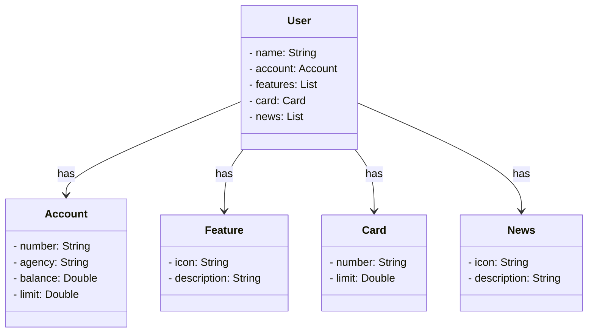

# Santander Trilha Java Backend 2023

Projeto Java RESTful  API criada para a Santander Trilha Java Backend 2023.

## Diagrama de Classes

```mermaid
classDiagram

class User {
  - name: String
  - account: Account
  - features: List<Feature>
  - card: Card
  - news: List<News>
}

class Account {
  - number: String
  - agency: String
  - balance: Double
  - limit: Double
}

class Feature {
  - icon: String
  - description: String
}

class Card {
  - number: String
  - limit: Double
}

class News {
  - icon: String
  - description: String
}

User --> Account : has
User --> Feature : has
User --> Card : has
User --> News : has
```
